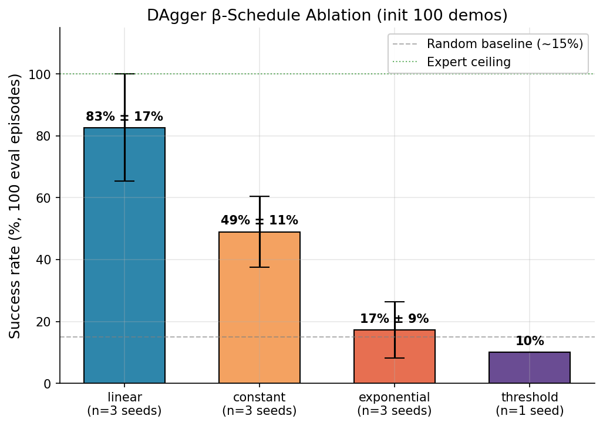
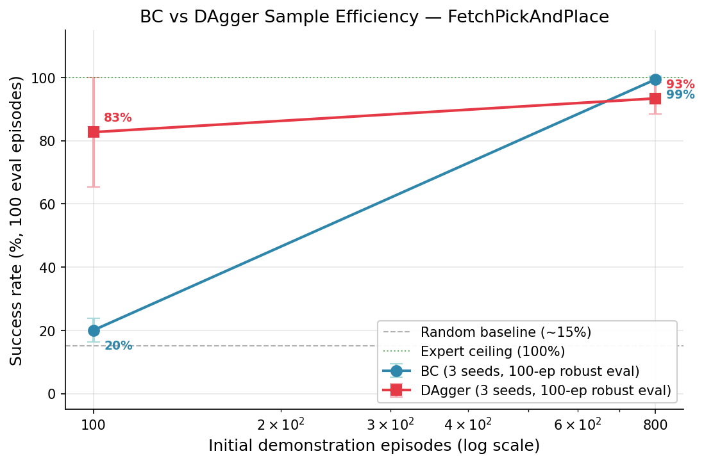
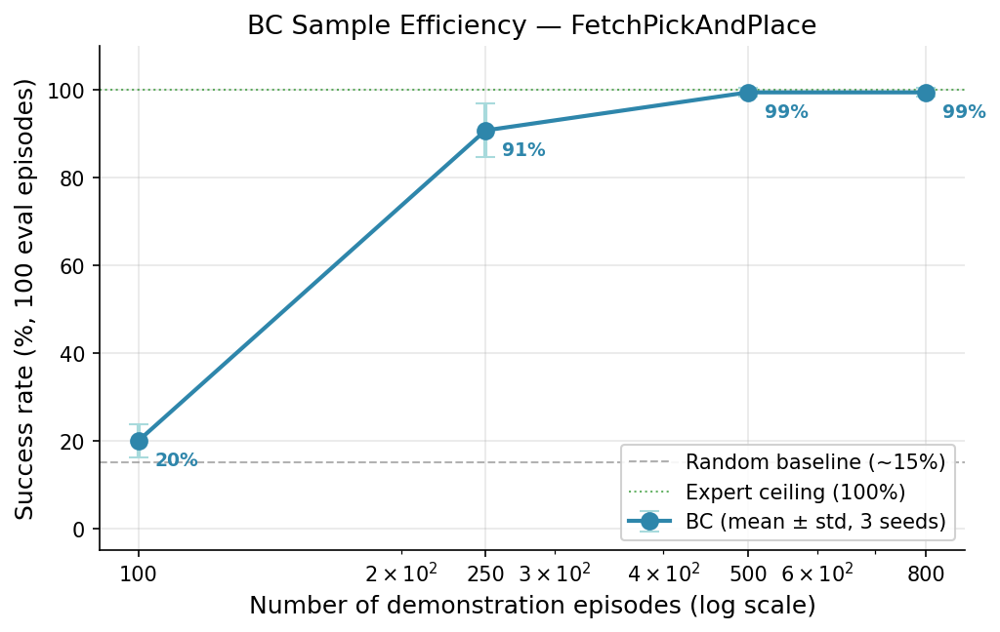
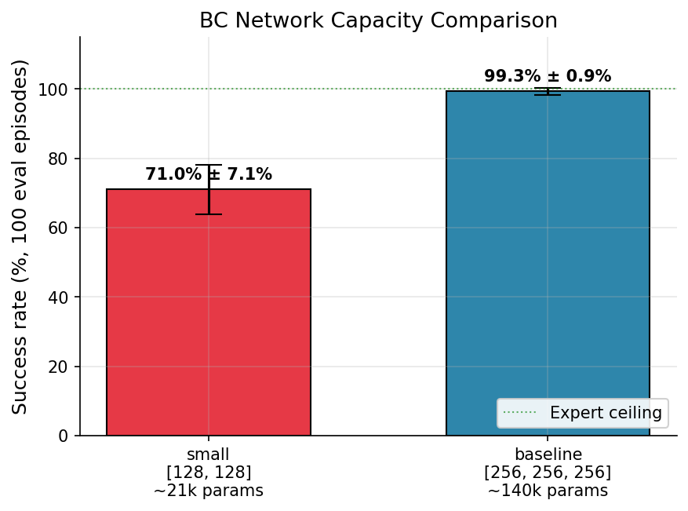
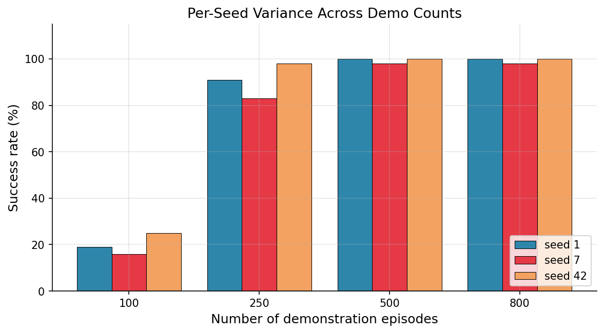

# franka-il-rl

End-to-end imitation learning to RL pipeline for robotic pick-and-place: Behavioral Cloning → DAgger → SAC fine-tuning on Franka Panda in MuJoCo, with ROS2 deployment and TensorRT inference.

## Overview

This project explores a complete imitation-to-reinforcement learning pipeline on a simulated robot arm. A scripted expert generates demonstrations in MuJoCo, which are first cloned via Behavioral Cloning, then refined interactively via DAgger, and finally fine-tuned with Soft Actor-Critic to surpass the expert. The final policy is exported to ONNX/TensorRT and deployed through a ROS2 Humble inference node, with the entire stack containerized via Docker.

The project emphasizes a side-by-side comparison of three learning paradigms (offline imitation, interactive imitation, online RL) under a single environment and evaluation harness, with controlled ablation studies on demonstration count, network capacity, expert design, and β scheduling. All experiments are reproducible via seed-controlled scripts and tracked in Weights & Biases.

## Current Status

**Phase 1 complete**, **Phase 2 nearing completion** (BC + DAgger done with ablations, SAC next).

### Headline Results (100-episode robust evaluation, 3 seeds)

| Configuration | Success rate |
|---|---|
| Random baseline | 15% (≈7% effective floor) |
| Scripted expert (ceiling) | 100% |
| **BC, 800 demos, baseline capacity** | **99.3% ± 0.9%** |
| BC, 100 demos | 20.0% ± 3.7% |
| BC, 250 demos | 90.7% ± 6.1% |
| BC, 500 demos | 99.3% ± 0.9% |
| BC, small capacity (~21k params) | 71.0% ± 7.1% |
| **DAgger linear β, init 100 demos** | **82.7% ± 17.0%** |
| DAgger linear β, init 800 demos | 93.3% ± 5.0% |
| DAgger constant β=0.3, init 100 | 49.0% ± 11.4% |
| DAgger exponential β decay 0.7, init 100 | 17.3% ± 9.1% |

All success rates are mean ± std across 3 seeds (42, 1, 7), 100 evaluation episodes each, on unseen initial conditions (seed_start=10000).

**Key findings:**
- DAgger starting from only 100 expert demonstrations (and growing to 300 via 200 expert-labeled policy rollouts) reaches 82.7% — vs BC's 20.0% with the same initial budget.
- Among four β schedules tested, linear decay clearly dominates; constant/exponential/threshold are all substantially worse.

## Tech Stack

- **Simulation:** MuJoCo 3.8, Gymnasium, gymnasium-robotics (FetchPickAndPlace-v4)
- **Learning:** PyTorch, custom BC and DAgger implementations (SAC upcoming)
- **Experiment tracking:** Weights & Biases
- **Deployment (planned):** ROS2 Humble, ONNX Runtime, TensorRT FP16
- **Infrastructure (planned):** Docker, docker-compose

## Project Structure

```
franka-il-rl/
├── configs/          # YAML configs per algorithm
├── envs/             # Gymnasium-compatible MuJoCo environment
├── experts/          # Scripted expert policy for demonstrations
├── algos/            # BC, DAgger, SAC implementations
├── networks/         # MLP and Gaussian policy networks
├── data_utils/       # Replay buffer and demonstration dataset
├── utils/            # Logging and seeding helpers
├── scripts/          # Entry points (training, evaluation, export)
├── data/             # Demonstrations and checkpoints (gitignored)
├── ros2_ws/          # ROS2 workspace for inference deployment
└── docker/           # Training and inference container definitions
```

## Roadmap

### Phase 1 — Foundations & Infrastructure

- [x] **Week 1** — Environment setup, MuJoCo sanity check, RL theory grounding
- [x] **Week 2** — Custom Franka env attempt (archived; see Project Notes)
- [x] **Week 3** — Fetch wrapper, scripted expert, demonstration collection
  - [x] gymnasium-robotics setup, `FetchPickPlaceWrapper`
  - [x] Scripted expert (1000/1000 success rate)
  - [x] Demonstration collection pipeline (1000 episodes, HDF5)
  - [x] Train/val/test split (80/10/10, episode-level)
- [x] **Week 4** — Data pipeline, evaluation harness, baseline metrics, W&B integration

### Phase 2 — Algorithms

- [x] **Week 5** — Behavioral Cloning implementation and training
- [x] **Week 6** — BC ablation studies (seed sensitivity, sample efficiency, capacity)
- [x] **Week 7** — DAgger implementation with β-scheduling + BC vs DAgger comparison
- [x] **Week 8** — DAgger variants exploration (β schedule sweep, stateless expert experiment)
  - [x] Stateless `FetchExpert` adapter attempted (negative result; see Week 8 details)
  - [x] β schedule ablation: linear vs constant vs exponential vs threshold, 3 seeds each
  - [x] Robust evaluation (100 eval episodes × all checkpoints)
- [ ] **Week 9** — SAC implementation from scratch, baseline training without warm-start
- [ ] **Week 10** — BC-warmstart SAC fine-tuning, demonstrations in replay buffer

### Phase 3 — Deployment & Evaluation

- [ ] **Week 11** — ROS2 inference node, MuJoCo-ROS2 bridge
- [ ] **Week 12** — ONNX export, TensorRT FP16 engine, latency benchmarking
- [ ] **Week 13** — Docker training & inference containers, docker-compose orchestration
- [ ] **Week 14** — Final ablation studies, technical report, README finalization

## Week 8 Results in Detail

### Stateless Expert Adapter — Negative Result

Week 7 identified a methodology artifact: in the 800-demo regime, DAgger underperformed BC (-6.0 pp). The hypothesized cause was the stateful nature of `FetchExpert`, which tracks an internal phase counter rather than re-deriving phase from each observation. When DAgger's policy visits unexpected states, the expert returns actions tied to its internal phase that may not be optimal for the visited state, producing noisy training labels.

We attempted a stateless adapter (`experts/fetch_expert_stateless.py`) that recomputes the appropriate phase from observation at each call. Three iterations were tried:

| Version | Approach | Result (50-ep eval) |
|---|---|---|
| v1 | Geometric phase derivation (xy/z thresholds) | 34% success |
| v2 | Added "object lifted" heuristic (object z > 0.46m) | 10% |
| v3 | Used gripper finger separation (obs[9], obs[10]) as closed-hand signal | 10% |

Failure modes traced via side-by-side trace with the stateful expert:
- **v1**: Premature transport — gripper closed and moved toward goal before the cube was securely grasped.
- **v2**: Gripper froze at the object during the implicit grasp window because the "object lifted" heuristic triggered too late.
- **v3**: Initial observation has finger separation ≈ 0 (env reset default), causing a false "closed-hand" reading at step 0; mid-grasp finger separation also drops to ~0.022 before the grasp is secure, triggering premature transport.

**The underlying difficulty**: scripted state-machine experts have implicit temporal dependencies (e.g. "hold gripper closed for 4 steps to let physics settle the grasp") that are not recoverable from any single observation. A pure stateless re-derivation either misses these windows entirely or triggers them prematurely.

**Conclusion**: The DAgger 800-demo paradox is real but the chosen fix is not implementable for this specific expert without a more elaborate stateful wrapper (e.g. one that simulates the expert forward from env reset). This is reported as a negative result and the limitation is acknowledged in the BC vs DAgger high-data comparison. Future work could attempt the simulation-based wrapper or evaluate DAgger on a task with a naturally state-conditional expert.

### β Schedule Ablation

DAgger's mixing coefficient β controls how much the expert vs the learner policy is used during rollouts. Week 7 used linear decay (β = 1 - i/N); Week 8 tested three alternatives on the low-data regime (100 initial demos, 10 DAgger iterations):

| Schedule | Formula | Behavior |
|---|---|---|
| **linear** (Week 7 default) | β = max(0, 1 - i/N) | Smooth full decay over 10 iters |
| constant | β = 0.3 | Sustained light expert mixing |
| exponential | β = 0.7^i | Fast smooth decay (β≈0.24 by iter 5) |
| threshold | β = 1 if i < 3 else 0 | Burn-in then pure policy |

3 seeds (42, 1, 7) per schedule, robust evaluation (100 episodes, seed_start=10000):

| Schedule | Mean success | Std | n |
|---|---|---|---|
| **linear** | **82.7%** | **17.0%** | 3 |
| constant β=0.3 | 49.0% | 11.4% | 3 |
| exponential decay=0.7 | 17.3% | 9.1% | 3 |
| threshold k=3 | 10.0% | — | 1 |



**Findings:**

- **Linear decay is the clear winner.** All alternatives are substantially worse. The threshold schedule was tested with a single seed first as a smoke test; given its low success (10%) further seeds were not pursued, as the result aligned with the schedule sweep's broader trend.
- **Two factors matter: total expert mixing AND smooth decay.** Linear provides both. Constant β=0.3 is smooth but provides too little expert assistance for the policy to bootstrap. Exponential decays too aggressively (β drops below 0.1 by iter 6). Threshold cuts expert assistance abruptly at iter 3, leaving the policy stranded before it has learned enough.
- **In-training eval was particularly misleading for these schedules.** Constant β=0.3 showed 70% in-training but only 49% robust eval (21 pp drop). Exponential showed 45% → 17% (28 pp drop). Linear remained tight: ~83% in-training → 82.7% robust. **Smooth-decay schedules don't just produce better policies; they produce policies whose in-training metric is more honest.**

The constant β=0.3 rollout success climbed steadily (10% → 85% by iter 10), suggesting it might match linear with a longer training budget. This is a possible future ablation but was not pursued for Week 8 scope.

## Week 7 Results in Detail

### BC vs DAgger Sample Efficiency

DAgger was tested in two regimes: starting from a weak BC baseline (100 demos) and a strong BC baseline (800 demos). In both cases, DAgger ran 10 iterations with linear β decay (1.0 → 0.1), collecting 20 mixed-policy rollouts per iteration with expert-labeled actions. The aggregated dataset was capped at 800 episodes (FIFO eviction).

| Demos | BC (mean ± std) | DAgger (mean ± std) | Δ |
|---|---|---|---|
| 100 | 20.0% ± 3.7% | 82.7% ± 17.0% | **+62.7 pp** |
| 800 | 99.3% ± 0.9% | 93.3% ± 5.0% | -6.0 pp |



**Per-seed breakdown:**

| Config | Seed 42 | Seed 1 | Seed 7 |
|---|---|---|---|
| DAgger init 100 | 100% | 59% | 89% |
| DAgger init 800 | 100% | 88% | 92% |

**Two distinct findings:**

**1. DAgger wins in the low-data regime.** With only 100 initial demonstrations (5000 frames), DAgger reaches 82.7% vs BC's 20.0% — a 62.7-point absolute improvement. The aggregated dataset grows from 100 to 300 episodes via 200 expert-labeled policy rollouts. This is the canonical sample efficiency win DAgger is designed for: states actually visited by the policy yield more useful training signal than states the expert happens to visit.

**2. DAgger does NOT help in the high-data regime, and may hurt.** With 800 initial demonstrations, BC already reaches 99.3% — and DAgger drops to 93.3%. This was unexpected. See Week 8 stateless expert experiment for the methodology investigation. The likely cause is the stateful nature of `FetchExpert`: during DAgger rollouts, the policy occasionally visits states the expert wouldn't reach on its own, and the expert returns an action based on its internal phase that does not match what would actually be optimal at the visited state. These noisy labels enter the aggregated dataset. When BC is far from saturation (100-demo case), the sample efficiency benefit outweighs the noise cost; when BC is already saturated (800-demo case), only the noise remains. This is not a flaw in DAgger as an algorithm but a limitation of pairing it with a stateful scripted expert. A stateless adapter was attempted (Week 8) without success.

**3. High variance in low-data DAgger.** The std of 17.0% (DAgger 100) vs 3.7% (BC 100) shows DAgger is sample-efficient but unstable at low data: seed 42 hit 100%, seed 1 only 59%. The first few iterations are critical — if early policy rollouts visit unrepresentative states, the dataset bias compounds across iterations.

## Week 6 Results in Detail

### A1: Sample Efficiency (BC)

How does BC scale with the number of expert demonstrations? Trained BC with `last.pt` checkpoint policy on increasing dataset sizes; evaluated each on 100 held-out episodes.

| Demo count | Mean success | Std | Min | Max |
|---|---|---|---|---|
| 100 | 20.0% | 3.7% | 16% | 25% |
| 250 | 90.7% | 6.1% | 83% | 98% |
| 500 | 99.3% | 0.9% | 98% | 100% |
| 800 | 99.3% | 0.9% | 98% | 100% |



**Findings:**
- **Sharp transition at 250 demos**: a 2.5× increase from 100→250 yields a 4.5× performance jump (20%→91%). Below ~150 demonstrations, BC is data-bound and falls back near the random floor.
- **Plateau at 500 demos**: performance saturates; the additional 300 demos in the 800-demo set add no value (99.3% in both). This identifies the practical data ceiling for this task.
- **Std collapses at high data**: variance across seeds shrinks from 3.7% (100 demos) to 0.9% (500+ demos), indicating that more data both improves and stabilizes BC.

### A2: Network Capacity

Does a smaller MLP suffice? Trained BC with a 2-layer (128, 128) network (~21k params) against the baseline 3-layer (256, 256, 256) network (~140k params), on the full 800-demo training set.

| Capacity | Hidden | Params | Mean success | Std |
|---|---|---|---|---|
| small | [128, 128] | ~21k | 71.0% | 7.1% |
| baseline | [256, 256, 256] | ~140k | 99.3% | 0.9% |



**Findings:**
- **7× fewer parameters cost 28% absolute success rate**. The small model is below the capacity sweet spot for this task; it underfits despite using the full training set.
- **Higher variance under small capacity**: std jumps from 0.9% to 7.1%, suggesting capacity-constrained models are more sensitive to initialization.
- **Implication**: BC's failure mode here is not overparameterization but underrepresentation of expert behavior at low capacity. The baseline 140k-param MLP is appropriately sized; further scaling is unlikely to help (would require larger A2 sweep to confirm).

### A3: Seed Sensitivity & Eval Methodology

The most important methodological finding of Week 6: small in-training evaluation suites are misleading.

| Eval setup | Seed 42 | Seed 1 | Seed 7 |
|---|---|---|---|
| In-training (20 episodes, seed 1000+) | 100% | 100% | 100% |
| Robust (100 episodes, seed 10000+) | 100% | 100% | **98%** |

The 20-episode eval suggested perfect, reproducible performance across all seeds. The 100-episode robust eval revealed seed 7's policy fails 2% of the time — visible only at sufficient sample size. Earlier `best_success.pt` checkpointing magnified this further (seed 7 dropped to 84% under that strategy), confirming that selecting "best" by a small eval suite captures lucky moments rather than representative policies. **All subsequent ablations adopted `last.pt` for evaluation.**



## Hardware

Developed and tested on:
- GPU: NVIDIA RTX 3050 Ti Laptop (4 GB VRAM)
- CPU: Intel i7 (11th gen)
- RAM: 16 GB
- OS: Ubuntu 22.04 (ROS2 Humble target for Phase 3)

## Reproducing Results

```bash
# 1. Collect demonstrations (one-time, ~5 min)
python scripts/collect_demos.py --num-episodes 1000 \
    --output data/demonstrations/demos.hdf5
python scripts/split_demos.py --input data/demonstrations/demos.hdf5 \
    --output-dir data/demonstrations --seed 42

# 2. Create demo subsets for ablations
python scripts/subset_demos.py --counts 100 250 500

# 3. Week 6 — BC ablations (~3 hours total on RTX 3050 Ti)
python scripts/ablate_seeds.py --seeds 42 1 7
python scripts/ablate_demo_count.py --demo-counts 100 250 500 --seeds 42 1 7
python scripts/ablate_capacity.py --capacities small --seeds 42 1 7

# 4. Week 7 — DAgger campaigns (~2.5 hours total)
./scripts/run_dagger_seeds.sh   # 6 runs: init {100, 800} × seeds {42, 1, 7}

# 5. Week 8 — β schedule ablation (~1.5 hours)
python scripts/ablate_dagger_beta.py \
    --schedules exponential constant --seeds 42 1 7

# 6. Robust evaluation on all checkpoints
python scripts/robust_eval.py \
    --checkpoints data/checkpoints/bc/*/last.pt \
    --num-episodes 100 --seed-start 10000 \
    --output data/checkpoints/bc/robust_eval_all.json

python scripts/robust_eval.py \
    --checkpoints data/checkpoints/dagger/*/last.pt \
    --num-episodes 100 --seed-start 10000 \
    --output data/checkpoints/dagger/dagger_robust_eval_all.json

# 7. Generate plots and tables
python scripts/plot_ablations.py
```

## Project Notes

**Week 3 pivot (May 2026)**: Initial attempt used a custom MuJoCo environment with Franka Panda and mink IK. After significant debugging of PD controller instability and IK convergence issues, switched to the standard `gymnasium-robotics` FetchPickAndPlace environment. This trades robot specificity for a battle-tested baseline, allowing focus on the core IL/RL algorithms (BC, DAgger, SAC) and the deployment pipeline. The legacy Franka code is preserved under `*_legacy.py` suffixes for reference.

**Random baseline note**: Random policy yields ~15% success rate on FetchPickAndPlace, of which ~8% stems from initial states where the object spawns within the 5cm success threshold of the goal (no policy action required). The effective "learning floor" for comparison is ~7%, while BC reaches 99% with sufficient data.

**Week 5 (BC baseline)**: BC trained on 800 trajectories reached 100% success rate by epoch 30 on the small in-training eval. Mean episode return improved from -42 (random-like) to -29 (faster than the expert's -32). The Week 6 robust evaluation later confirmed this generalizes to 99.3% on 100 held-out episodes.

**Week 6 methodology**: The biggest lesson of Week 6 was that strong-looking results require strong evaluation. A 3-seed × 20-episode eval suggested BC was perfectly solving the task; a 3-seed × 100-episode eval (with held-out seed range) exposed variance and instability invisible at smaller scales. All future algorithm comparisons in this project use the same robust-eval protocol: ≥100 episodes per checkpoint, multiple seeds, evaluation seeds disjoint from training/in-training-eval seeds.

**Week 7 — DAgger sample efficiency vs high-data noise**: DAgger demonstrated its classical sample efficiency advantage in the low-data regime (+62.7 pp over BC at 100 demos) but underperformed BC in the high-data regime (-6.0 pp at 800 demos). The likely cause is the stateful nature of the scripted expert; see Week 8 for the (unsuccessful) attempt to fix this.

**Week 8 — stateless expert and β scheduling**: Two ablations. (1) A stateless `FetchExpert` adapter was attempted to fix the Week 7 DAgger 800 paradox; three iterations all failed because scripted state-machine experts encode implicit temporal dependencies not recoverable from single observations. The negative result is documented in `experts/fetch_expert_stateless.py`. (2) A β-schedule sweep showed that DAgger's standard linear decay strongly outperforms alternatives (constant, exponential, threshold); the combination of "smooth decay" and "sufficient cumulative expert mixing" matters, and aggressive or abrupt schedules fail.

**Why BC is unusually strong on this task**: The Fetch environment has a short horizon (50 steps), low-dimensional state-based observations (28-D), and a low-DoF action space (4-D EE delta + gripper). These properties minimize compounding error, which is BC's classical weakness. On image-based or longer-horizon tasks, the gap between BC and interactive methods (DAgger) or RL fine-tuning (SAC) is expected to widen.

**A note on in-training vs robust evaluation**: Across all ablations, in-training success rate (20 episodes, seeds 1000+) systematically overestimated robust success rate (100 episodes, seeds 10000+). The gap was small for well-tuned configurations (linear β DAgger: ~1 pp) but large for marginal ones (exponential β: 28 pp). This is a generalizable lesson about evaluation methodology: small in-distribution eval suites should never be the basis for algorithmic conclusions.

## License

MIT

## Author

Emin Çağan Apaydın — [github.com/e-cagan](https://github.com/e-cagan)