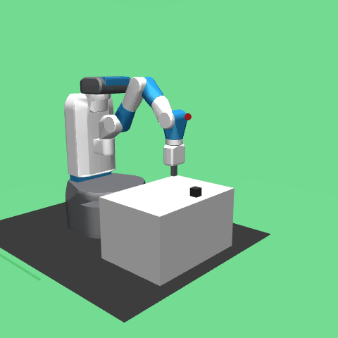
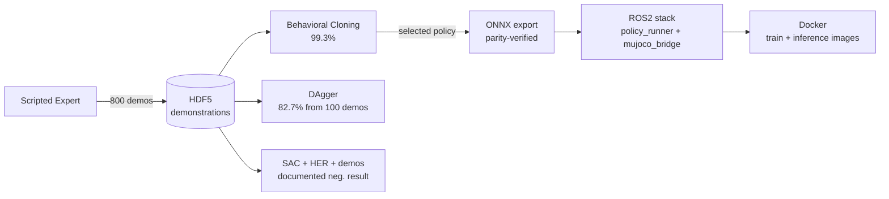

# franka-il-rl



*A from-scratch behavioral-cloning policy (99.3% success) placing the cube across varied initial conditions, running through the containerized ROS2 inference pipeline.*

End-to-end imitation learning to RL pipeline for robotic pick-and-place: Behavioral Cloning → DAgger → SAC fine-tuning on Franka Panda in MuJoCo, with ROS2 deployment and multi-backend (PyTorch / ONNX / TensorRT) inference.

## Overview

This project explores a complete imitation-to-reinforcement learning pipeline on a simulated robot arm. A scripted expert generates demonstrations in MuJoCo, which are first cloned via Behavioral Cloning, then refined interactively via DAgger, and finally trained from scratch with Soft Actor-Critic to evaluate online RL on the same task. The final BC-trained policy is exported to ONNX and deployed through a ROS2 Humble inference node behind a swappable backend interface (PyTorch / ONNX / TensorRT), with the entire stack containerized via Docker.

The project emphasizes a side-by-side comparison of three learning paradigms (offline imitation, interactive imitation, online RL) under a single environment and evaluation harness, with controlled ablation studies on demonstration count, network capacity, expert design, and β scheduling. All experiments are reproducible via seed-controlled scripts and tracked in Weights & Biases.



All training and inference run inside Docker; the deployed policy serves inference at 71k Hz (ONNX-CPU) through the ROS2 stack.

## Current Status

**Phase 2 complete. Phase 3 nearly complete** — ROS2 deployment (Week 11), Docker containerization (Week 12), and ONNX/multi-backend inference with latency benchmarking (Week 13) all done. A trained policy runs end-to-end through a containerized ROS2 stack at 71k Hz (ONNX-CPU). Only the final report and README polish (Week 14) remain.

### Headline Results (100-episode robust evaluation, 3 seeds)

| Configuration | Success rate |
|---|---|
| Random baseline | 15% (≈7% effective floor) |
| Scripted expert (ceiling) | 100% |
| **BC, 800 demos, baseline capacity** | **99.3% ± 0.9%** |
| BC, 100 demos | 20.0% ± 3.7% |
| BC, 250 demos | 90.7% ± 6.1% |
| BC, 500 demos | 99.3% ± 0.9% |
| BC, small capacity (~21k params) | 71.0% ± 7.1% |
| **DAgger linear β, init 100 demos** | **82.7% ± 17.0%** |
| DAgger linear β, init 800 demos | 93.3% ± 5.0% |
| DAgger constant β=0.3, init 100 | 49.0% ± 11.4% |
| DAgger exponential β decay 0.7, init 100 | 17.3% ± 9.1% |
| SAC from scratch, sparse reward | ~10% (random baseline) |
| SAC + HER, sparse reward | ~20% peak |
| SAC + HER + demo prefill (DAPG-style) | ~10% (no learning) |

BC and DAgger success rates are mean ± std across 3 seeds (42, 1, 7), 100 evaluation episodes each, on unseen initial conditions (seed_start=10000). SAC results are best-of-run from single-seed exploration; see Week 9 and Week 10 for the analysis of why online RL does not converge on this task without algorithmic changes beyond the SAC + HER + demos scope.

**Key findings:**
- DAgger starting from only 100 expert demonstrations (and growing to 300 via 200 expert-labeled policy rollouts) reaches 82.7% — vs BC's 20.0% with the same initial budget.
- Among four β schedules tested, linear decay clearly dominates; constant/exponential/threshold are all substantially worse.
- SAC trained from scratch on sparse FetchPickAndPlace does not converge, even with HER and demo pre-fill. The bottleneck is offline-to-online distribution shift between the demonstration-warmed critic and the random-initialized actor — a known limitation requiring specialized offline-to-online algorithms (AWAC, IQL, CalQL) that fall outside this project's scope.

## Tech Stack

- **Simulation:** MuJoCo 3.8, Gymnasium, gymnasium-robotics (FetchPickAndPlace-v4)
- **Learning:** PyTorch, custom BC, DAgger, and SAC implementations
- **Experiment tracking:** Weights & Biases
- **Deployment (Phase 3):** ROS2 Humble, swappable inference backends — PyTorch / ONNX Runtime (selected: ONNX-CPU) / TensorRT EP
- **Infrastructure (Phase 3):** Docker, docker-compose

## Project Structure

```
franka-il-rl/
├── configs/          # YAML configs per algorithm
├── envs/             # Gymnasium-compatible MuJoCo environment
├── experts/          # Scripted expert policy for demonstrations
├── algos/            # BC, DAgger, SAC implementations
├── networks/         # MLP and Gaussian policy networks
├── data_utils/       # Replay buffer (vanilla + HER) and demonstration dataset
├── utils/            # Logging and seeding helpers
├── scripts/          # Entry points (training, evaluation, export)
├── data/             # Demonstrations and checkpoints (gitignored)
├── ros2_ws/          # ROS2 workspace for inference deployment
└── docker/           # Training and inference container definitions
```

## Roadmap

### Phase 1 — Foundations & Infrastructure

- [x] **Week 1** — Environment setup, MuJoCo sanity check, RL theory grounding
- [x] **Week 2** — Custom Franka env attempt (archived; see Project Notes)
- [x] **Week 3** — Fetch wrapper, scripted expert, demonstration collection
- [x] **Week 4** — Data pipeline, evaluation harness, baseline metrics, W&B integration

### Phase 2 — Algorithms

- [x] **Week 5** — Behavioral Cloning implementation and training
- [x] **Week 6** — BC ablation studies (seed sensitivity, sample efficiency, capacity)
- [x] **Week 7** — DAgger implementation with β-scheduling + BC vs DAgger comparison
- [x] **Week 8** — DAgger variants exploration (β schedule sweep, stateless expert experiment)
- [x] **Week 9** — SAC implementation from scratch, stability fixes, sparse-reward limitation identified
- [x] **Week 10** — HER + demo prefill (DAPG-style); convergence blocked by distribution shift, documented as open problem

### Phase 3 — Deployment & Evaluation

- [x] **Week 11** — ROS2 inference node, MuJoCo-ROS2 bridge
- [x] **Week 12** — Docker training & inference containers, docker-compose orchestration *(pulled ahead of ONNX/TensorRT to fix the host Python/ROS2 environment conflict first)*
- [x] **Week 13** — ONNX export, multi-backend inference, latency benchmarking (TensorRT integrated; found unnecessary at this model scale)
- [x] **Week 14** — Final ablation studies, technical report, README finalization

*Note: Weeks 12 and 13 were swapped from the original plan. Containerizing first eliminated a host-environment Python version conflict (venv 3.12 vs ROS2 3.10) that was repeatedly stalling deployment work, giving ONNX/TensorRT a clean fixed-version environment to build in.*

## Week 13 Results in Detail (ONNX + Inference Backends)

### Multi-Backend Inference and the GPU-Overhead Crossover

The Strategy-pattern `InferenceBackend` from Week 11 was filled out with two more backends so the policy can run through PyTorch, ONNX Runtime, or TensorRT with a single launch-arg change (`backend:=torch|onnx|tensorrt`) and no node-code change:

- **`scripts/export_onnx.py`** exports the BC policy to ONNX (opset 17, dynamic batch axis) and verifies numerical parity against the PyTorch forward pass. Parity: max abs diff 5.5e-6 over 200 random observations (fp32 export reordering noise; well under the 1e-4 tolerance).
- **`OnnxBackend`** runs the `.onnx` via ONNX Runtime (CPU or CUDA execution provider). Verified to reproduce the BC baseline through the full ROS2 stack.
- **`TensorRTBackend`** runs through ONNX Runtime's TensorRT EP (FP16, with engine caching), falling back to CUDA/CPU if the TRT libraries are unavailable.

### Latency Benchmark (batch=1, 5000 iters, RTX 3050 Ti laptop)

| Backend | Throughput | Mean latency |
|---|---|---|
| **onnx-cpu** | **71,069 Hz** | 0.014 ms |
| onnx-cuda | 16,413 Hz | 0.061 ms |
| torch-cpu | 15,813 Hz | 0.063 ms |
| torch-cuda | 7,144 Hz | 0.140 ms |

**The headline finding: GPU execution is *slower* than CPU for this policy, and TensorRT is unnecessary.** The policy is a tiny MLP (~140k params, 28→4). At batch=1, the host↔device memory transfer cost dominates the trivial compute, so both CUDA backends are 4–10× slower than their CPU counterparts. ONNX-CPU is fastest at 71k Hz — **2,800× the 25 Hz control requirement**, with a 0.014 ms latency that is 0.035% of the 40 ms per-step budget.

TensorRT was integrated (`TensorRTBackend` + provider options), but the TRT execution provider failed to load due to a `libnvinfer.so.10` library-path misalignment between `onnxruntime-gpu` and the `tensorrt` pip package — a known version-coupling issue. Rather than chase the fix, the benchmark made the engineering decision clear: even a successful TensorRT FP16 build (perhaps ~100k Hz) would be indistinguishable from ONNX-CPU's 71k Hz against a 25 Hz target. **ONNX-CPU was selected for deployment**, and TensorRT was documented as integrated-but-unnecessary at this model scale. The TensorRT path remains relevant for the eventual Jetson Orin Nano target, where it would be built on-device.

This is a deliberate avoidance of premature optimization: the right backend was chosen by measurement, not by reaching for the most sophisticated tool available.

## Week 12 Results in Detail (Docker)

### Containerization — Two Images, Fixed Environments

Deployment work on bare metal repeatedly stalled on a Python version conflict: the project's training venv runs Python 3.12, while ROS2 Humble is hard-coupled to the system's Python 3.10. Sharing a `PYTHONPATH` between them produced numpy C-extension ABI failures (`No module named 'numpy.core._multiarray_umath'`) because 3.10 cannot load extensions compiled for 3.12. Containerization was pulled ahead of the ONNX/TensorRT work specifically to remove this class of problem before adding more version-sensitive dependencies.

Two images, intentionally not sharing a base (different needs):

- **`Dockerfile.train`** — base `pytorch/pytorch:2.5.1-cuda12.1-cudnn9-runtime`. No ROS2. Carries torch + CUDA, gymnasium-robotics, mujoco, h5py, wandb. Runs BC/DAgger/SAC training and demo collection. Verified `CUDA available: True` with `--gpus all` passthrough on the RTX 3050 Ti.
- **`Dockerfile.inference`** — base `ros:humble` (Ubuntu 22.04, Python 3.10 fixed — this *is* the fix). PyTorch installed from the cu121 wheel (bundles its own CUDA runtime, so no system CUDA needed; works through the host driver + nvidia container runtime). Builds the ROS2 workspace and runs the full inference pipeline. Verified to reproduce the Week 11 result (BC baseline, success through the containerized stack) identically.

Design decisions:
- **Container builds the ROS2 workspace into `/tmp`, not the volume-mounted `ros2_ws/build`.** The repo is bind-mounted for live code editing, which means the container sees the host's build artifacts. Building into container-local `/tmp/colcon_build` and `/tmp/colcon_install` keeps host and container build trees fully separate, preventing cross-environment contamination.
- **Inference uses host networking** so `ros2 topic echo` works from the host and DDS discovery between the two in-container nodes is trivial.
- **`docker-compose.yml`** declares both services with GPU reservations and `MUJOCO_GL=egl` for headless rendering. Training and inference are run via `docker compose run --rm <service> <command>`, with the default inference command running the full pipeline on the BC baseline.

This stack is the foundation for the eventual Jetson Orin Nano deployment (Week 13+): the inference image's structure (ROS2 + bundled-CUDA torch + headless MuJoCo) ports to an `l4t-base` ARM image with the same entrypoint logic.

## Week 11 Results in Detail (ROS2 Deployment)

### Inference Node + MuJoCo Bridge — Policy Running Through ROS2

Built a two-package ROS2 Humble workspace to run trained policies through a message-passing deployment stack, decoupling the policy (inference) from the environment (simulation):

- **`policy_runner`** — backend-agnostic inference node. Subscribes to `/sim/observation` (28-D `Float32MultiArray`), runs the policy, publishes to `/sim/action` (4-D). The actual obs→action computation is delegated to a pluggable `InferenceBackend` (Strategy pattern): `TorchBackend` for Week 11, with `OnnxBackend` and `TensorRTBackend` added in Week 13. Swapping backends is a single launch argument (`backend:=torch|onnx|tensorrt`); the node code never changes.
- **`mujoco_bridge`** — wraps the `FetchPickPlaceWrapper` env, publishes observations, subscribes to actions, broadcasts episode info. Drives a ping-pong control loop rather than a fixed-rate timer: reset → publish obs → receive action → step → publish next obs. For sim-only eval (no real-time deadline) this is simpler and faster than rate-limiting.

Two non-obvious issues surfaced and were resolved:

1. **Startup race / control-loop stall.** The bridge publishes its first observation during `__init__`, before the inference node (a separate process) has finished DDS discovery and subscription setup. With best-effort QoS, that first observation was dropped, and since the loop is strictly turn-based, both nodes then waited on each other forever. Fixed by making the observation topic **latched** (`TRANSIENT_LOCAL` durability) and `RELIABLE` on both publisher and subscriber: a late-joining subscriber still receives the most recent observation, and no mid-loop message is dropped.
2. **Render deadlock.** MuJoCo's human-mode viewer needs the main thread to pump its event loop; calling `env.render()` inside the step callback (or not at all) froze the GUI ("not responding"). Resolved for headless operation (the deployment default, since the Jetson target has no display); interactive rendering is treated as a separate dev-only concern.

Verified end to end: the BC baseline (`bc_seed42`) runs at 200/200 success through the full ROS2 stack, with CPU inference sustaining ~430 Hz (well above the 25 Hz control rate). Both headless and rendered modes confirmed working.

## Week 10 Results in Detail

### HER + Demo Prefill — Offline-to-Online Distribution Shift Blocks Convergence

Week 9 identified that plain SAC cannot solve sparse FetchPickAndPlace because random exploration fails to grasp the cube. Week 10 implemented Hindsight Experience Replay (Andrychowicz et al., 2017) and demo pre-fill (DAPG-style, Rajeswaran et al., 2018) on top of the SAC trainer to address this. Two iterations:

**Iteration 1 — Plain HER (`future` strategy, k=4).** Implemented an episode-aware `HERReplayBuffer` that stages transitions during an episode and, on flush, writes T originals plus (T-1)·k relabeled copies whose `desired_goal` is replaced by an `achieved_goal` reached later in the same episode. The wrapper was extended to expose `info["achieved_goal"]` on every reset/step and to proxy the underlying env's `compute_reward` so the buffer can recompute rewards under synthetic goals. Trained 200k env steps. Algorithm fully stable (alpha ~0.07, Q-loss < 5), but eval success peaked at 20%, indistinguishable from the random baseline.

Root cause: HER requires the `achieved_goal` to vary meaningfully across an episode for its relabels to be informative. Random policy never grasps the cube, so the cube stays at its spawn position throughout the episode. Relabeled `desired_goal` then equals the cube's initial position, the distance is below threshold, and every relabeled transition is a trivial reward=0 success. The buffer fills with "stay near the cube" exemplars that teach nothing about pick-and-place.

**Iteration 2 — HER + demo prefill (DAPG-style).** Added a `_prefill_from_demos` method that loads the 800-trajectory expert HDF5, stages each demo episode into the HER buffer, and flushes — producing 800 × 246 ≈ 197k seed transitions (originals + HER relabels) before the SAC training loop begins. The intent: give HER the diverse `achieved_goal` trajectories it needs, by sourcing them from successful expert episodes rather than random rollouts. Trained 90k+ env steps. Result identical: 10% eval success, no learning.

Root cause: the demonstration tuples teach the **critic** (Q-network) where good (state, expert_action) pairs sit in value space, but the **actor** is initialized randomly and samples on-policy actions far from the demo distribution. The critic's Q estimates outside the demo support are untrustworthy, so the actor receives noisy gradients. Auto-alpha climbs to ~0.27 chasing the entropy target, the policy collapses to "do nothing" (return -45 = 50 × -1), and the system reaches a stable but uninformative equilibrium.

This is the classical **offline-to-online distribution shift** problem in deep RL. Standard SAC is not designed for this regime; algorithms purpose-built for it (AWAC, IQL, CalQL) constrain the actor to stay near the data distribution while learning. Implementing one of those is a separate project; this work documents the limitation as encountered.

**What works in this codebase:** the SAC implementation itself is mathematically correct and numerically stable across all configurations tested. The HER buffer correctly produces T + (T-1)·k entries per episode, sample composition is ≈1/(1+k) originals and k/(1+k) relabels by uniform sampling, and the demo prefill loads cleanly. The remaining gap is algorithmic, not implementational.

**Conclusion**: SAC + HER + demos is a strong implementation exercise — twin Q, reparameterized tanh-Gaussian policy, auto-tuned entropy temperature, hindsight relabeling, DAPG-style buffer seeding — but does not solve sparse FetchPickAndPlace from scratch. BC (99.3%) and DAgger (82.7%) remain the deployed policies; SAC is preserved as a reference implementation and a documented negative result.

## Week 9 Results in Detail

### SAC Baseline — Stable but Task-Bound Without Algorithmic Augmentation

Implemented SAC from scratch (twin Q-networks, tanh-squashed Gaussian policy with reparameterization, auto-tuned entropy temperature, soft target updates) and trained on FetchPickAndPlace. Three iterations:

**Iteration 1 — Sparse reward, target_entropy = -|A| = -4 (Haarnoja default).** Trained 30k steps. Diverged: alpha exploded (0.2 → 1280), Q-values exploded in tandem (Q1 mean reaching +48k mid-training, trajectory toward +320k equilibrium), entropy stuck at ~2.7, eval success at random baseline (10%).

Root cause: target_entropy = -4 is unreachable for a 4-D tanh-squashed Gaussian. The achievable differential entropy ceiling is 4·log(2) ≈ 2.77 (uniform distribution over [-1,1]^4). The auto-tuning loop indefinitely pushes alpha up trying to reach an impossible target, and once alpha grows, the bootstrap entropy bonus α·|log π| dominates the Bellman target, driving Q-values positive in a self-reinforcing feedback loop.

**Iteration 2 — Sparse reward, target_entropy = -2.** Alpha now converges to a stable equilibrium (~0.07), Q-loss bounded, no divergence. But eval success still stuck at 10%: the sparse -1-per-step reward provides insufficient learning signal for SAC's random exploration to discover successful grasps.

**Iteration 3 — Dense reward (negative cube-to-goal distance), target_entropy = -2.** Algorithm fully stable across 60k steps (alpha ~0.07, Q-loss < 1.0). But the policy converges to a trivial do-nothing behavior (eval return -9.7, corresponding to "arm stationary, cube unmoved for 50 steps"). This is a known property of dense FetchPickAndPlace: until the cube is grasped, the `achieved_goal` (cube position) does not move, so dense reward is flat through the grasping phase, providing no exploration signal.

**Conclusion**: SAC implementation is mathematically correct and numerically stable. The remaining barrier is exploration in a goal-conditioned sparse-reward setting — addressed in Week 10 via HER and demo pre-fill (with mixed results; see above).

## Week 8 Results in Detail

### Stateless Expert Adapter — Negative Result

Week 7 identified a methodology artifact: in the 800-demo regime, DAgger underperformed BC (-6.0 pp). The hypothesized cause was the stateful nature of `FetchExpert`, which tracks an internal phase counter rather than re-deriving phase from each observation. When DAgger's policy visits unexpected states, the expert returns actions tied to its internal phase that may not be optimal for the visited state, producing noisy training labels.

We attempted a stateless adapter (`experts/fetch_expert_stateless.py`) that recomputes the appropriate phase from observation at each call. Three iterations were tried:

| Version | Approach | Result (50-ep eval) |
|---|---|---|
| v1 | Geometric phase derivation (xy/z thresholds) | 34% success |
| v2 | Added "object lifted" heuristic (object z > 0.46m) | 10% |
| v3 | Used gripper finger separation (obs[9], obs[10]) as closed-hand signal | 10% |

Failure modes traced via side-by-side trace with the stateful expert:
- **v1**: Premature transport — gripper closed and moved toward goal before the cube was securely grasped.
- **v2**: Gripper froze at the object during the implicit grasp window because the "object lifted" heuristic triggered too late.
- **v3**: Initial observation has finger separation ≈ 0 (env reset default), causing a false "closed-hand" reading at step 0; mid-grasp finger separation also drops to ~0.022 before the grasp is secure, triggering premature transport.

**The underlying difficulty**: scripted state-machine experts have implicit temporal dependencies (e.g. "hold gripper closed for 4 steps to let physics settle the grasp") that are not recoverable from any single observation. A pure stateless re-derivation either misses these windows entirely or triggers them prematurely.

**Conclusion**: The DAgger 800-demo paradox is real but the chosen fix is not implementable for this specific expert without a more elaborate stateful wrapper (e.g. one that simulates the expert forward from env reset). This is reported as a negative result and the limitation is acknowledged in the BC vs DAgger high-data comparison. Future work could attempt the simulation-based wrapper or evaluate DAgger on a task with a naturally state-conditional expert.

### β Schedule Ablation

DAgger's mixing coefficient β controls how much the expert vs the learner policy is used during rollouts. Week 7 used linear decay (β = 1 - i/N); Week 8 tested three alternatives on the low-data regime (100 initial demos, 10 DAgger iterations):

| Schedule | Formula | Behavior |
|---|---|---|
| **linear** (Week 7 default) | β = max(0, 1 - i/N) | Smooth full decay over 10 iters |

## Week 6 Results in Detail

### A1: Sample Efficiency (BC)

How does BC scale with the number of expert demonstrations? Trained BC with `last.pt` checkpoint policy on increasing dataset sizes; evaluated each on 100 held-out episodes.

| Demo count | Mean success | Std | Min | Max |
|---|---|---|---|---|
| 100 | 20.0% | 3.7% | 16% | 25% |
| 250 | 90.7% | 6.1% | 83% | 98% |
| 500 | 99.3% | 0.9% | 98% | 100% |
| 800 | 99.3% | 0.9% | 98% | 100% |


**Findings:**
- **Sharp transition at 250 demos**: a 2.5× increase from 100→250 yields a 4.5× performance jump (20%→91%). Below ~150 demonstrations, BC is data-bound and falls back near the random floor.
- **Plateau at 500 demos**: performance saturates; the additional 300 demos in the 800-demo set add no value (99.3% in both). This identifies the practical data ceiling for this task.
- **Std collapses at high data**: variance across seeds shrinks from 3.7% (100 demos) to 0.9% (500+ demos), indicating that more data both improves and stabilizes BC.

### A2: Network Capacity

Does a smaller MLP suffice? Trained BC with a 2-layer (128, 128) network (~21k params) against the baseline 3-layer (256, 256, 256) network (~140k params), on the full 800-demo training set.

| Capacity | Hidden | Params | Mean success | Std |
|---|---|---|---|---|
| small | [128, 128] | ~21k | 71.0% | 7.1% |
| baseline | [256, 256, 256] | ~140k | 99.3% | 0.9% |


**Findings:**
- **7× fewer parameters cost 28% absolute success rate**. The small model is below the capacity sweet spot for this task; it underfits despite using the full training set.
- **Higher variance under small capacity**: std jumps from 0.9% to 7.1%, suggesting capacity-constrained models are more sensitive to initialization.
- **Implication**: BC's failure mode here is not overparameterization but underrepresentation of expert behavior at low capacity. The baseline 140k-param MLP is appropriately sized; further scaling is unlikely to help (would require larger A2 sweep to confirm).

### A3: Seed Sensitivity & Eval Methodology

The most important methodological finding of Week 6: small in-training evaluation suites are misleading.

| Eval setup | Seed 42 | Seed 1 | Seed 7 |
|---|---|---|---|
| In-training (20 episodes, seed 1000+) | 100% | 100% | 100% |
| Robust (100 episodes, seed 10000+) | 100% | 100% | **98%** |

The 20-episode eval suggested perfect, reproducible performance across all seeds. The 100-episode robust eval revealed seed 7's policy fails 2% of the time — visible only at sufficient sample size. Earlier `best_success.pt` checkpointing magnified this further (seed 7 dropped to 84% under that strategy), confirming that selecting "best" by a small eval suite captures lucky moments rather than representative policies. **All subsequent ablations adopted `last.pt` for evaluation.**


## Hardware

Developed and tested on:
- GPU: NVIDIA RTX 3050 Ti Laptop (4 GB VRAM)
- CPU: Intel i7 (11th gen)
- RAM: 16 GB
- OS: Ubuntu 22.04 (ROS2 Humble target for Phase 3)

## Reproducing Results

```bash
# 1. Collect demonstrations (one-time, ~5 min)
python scripts/collect_demos.py --num-episodes 1000 \
    --output data/demonstrations/demos.hdf5
python scripts/split_demos.py --input data/demonstrations/demos.hdf5 \
    --output-dir data/demonstrations --seed 42

# 2. Create demo subsets for ablations
python scripts/subset_demos.py --counts 100 250 500

# 3. Week 6 — BC ablations (~3 hours total on RTX 3050 Ti)
python scripts/ablate_seeds.py --seeds 42 1 7
python scripts/ablate_demo_count.py --demo-counts 100 250 500 --seeds 42 1 7
python scripts/ablate_capacity.py --capacities small --seeds 42 1 7

# 4. Week 7 — DAgger campaigns (~2.5 hours total)
./scripts/run_dagger_seeds.sh   # 6 runs: init {100, 800} × seeds {42, 1, 7}

# 5. Week 8 — β schedule ablation (~1.5 hours)
python scripts/ablate_dagger_beta.py \
    --schedules exponential constant --seeds 42 1 7

# 6. Robust evaluation on all checkpoints
python scripts/robust_eval.py \
    --checkpoints data/checkpoints/bc/*/last.pt \
    --num-episodes 100 --seed-start 10000 \
    --output data/checkpoints/bc/robust_eval_all.json

python scripts/robust_eval.py \
    --checkpoints data/checkpoints/dagger/*/last.pt \
    --num-episodes 100 --seed-start 10000 \
    --output data/checkpoints/dagger/dagger_robust_eval_all.json

# 7. Week 9 — SAC baseline (sparse, stable but does not converge)
python scripts/train_sac.py --config configs/sac.yaml

# 8. Week 10 — SAC + HER + demos (negative result, documented)
python scripts/train_sac.py --config configs/sac_her.yaml

# 9. Generate plots and tables
python scripts/plot_ablations.py
```

### Containerized (Week 12+)

All training and inference can run in Docker, avoiding host environment setup:

```bash
# Build both images (first build ~3 min; layers cache afterward)
docker compose -f docker/docker-compose.yml build

# GPU sanity check (expects "CUDA available: True")
docker compose -f docker/docker-compose.yml run --rm train

# Train in-container (override the default command)
docker compose -f docker/docker-compose.yml run --rm train \
    python scripts/train_sac.py --config configs/sac_her.yaml

# Run the full ROS2 inference pipeline (BC baseline by default)
docker compose -f docker/docker-compose.yml run --rm inference

# ...with a different checkpoint / GPU inference
docker compose -f docker/docker-compose.yml run --rm inference \
    ros2 launch policy_runner full_pipeline.launch.py \
    device:=cuda checkpoint:=/workspace/data/checkpoints/dagger/dagger_init100_seed42/last.pt

# Export a checkpoint to ONNX (with parity check) and run via the ONNX backend
docker compose -f docker/docker-compose.yml run --rm inference \
    python3 scripts/export_onnx.py --checkpoint /workspace/data/checkpoints/bc/bc_seed42/last.pt
docker compose -f docker/docker-compose.yml run --rm inference \
    ros2 launch policy_runner full_pipeline.launch.py \
    backend:=onnx checkpoint:=/workspace/data/checkpoints/bc/bc_seed42/last.onnx

# Benchmark inference latency across torch / onnx / tensorrt backends
docker compose -f docker/docker-compose.yml run --rm inference \
    python3 scripts/benchmark_latency.py --checkpoint /workspace/data/checkpoints/bc/bc_seed42/last.pt
```

## Project Notes

**Week 3 pivot (May 2026)**: Initial attempt used a custom MuJoCo environment with Franka Panda and mink IK. After significant debugging of PD controller instability and IK convergence issues, switched to the standard `gymnasium-robotics` FetchPickAndPlace environment. This trades robot specificity for a battle-tested baseline, allowing focus on the core IL/RL algorithms (BC, DAgger, SAC) and the deployment pipeline. The legacy Franka code is preserved under `*_legacy.py` suffixes for reference.

**Random baseline note**: Random policy yields ~15% success rate on FetchPickAndPlace, of which ~8% stems from initial states where the object spawns within the 5cm success threshold of the goal (no policy action required). The effective "learning floor" for comparison is ~7%, while BC reaches 99% with sufficient data.

**Week 5 (BC baseline)**: BC trained on 800 trajectories reached 100% success rate by epoch 30 on the small in-training eval. Mean episode return improved from -42 (random-like) to -29 (faster than the expert's -32). The Week 6 robust evaluation later confirmed this generalizes to 99.3% on 100 held-out episodes.

**Week 6 methodology**: The biggest lesson of Week 6 was that strong-looking results require strong evaluation. A 3-seed × 20-episode eval suggested BC was perfectly solving the task; a 3-seed × 100-episode eval (with held-out seed range) exposed variance and instability invisible at smaller scales. All future algorithm comparisons in this project use the same robust-eval protocol: ≥100 episodes per checkpoint, multiple seeds, evaluation seeds disjoint from training/in-training-eval seeds.

**Week 7 — DAgger sample efficiency vs high-data noise**: DAgger demonstrated its classical sample efficiency advantage in the low-data regime (+62.7 pp over BC at 100 demos) but underperformed BC in the high-data regime (-6.0 pp at 800 demos). The likely cause is the stateful nature of the scripted expert; see Week 8 for the (unsuccessful) attempt to fix this.

**Week 8 — stateless expert and β scheduling**: Two ablations. (1) A stateless `FetchExpert` adapter was attempted to fix the Week 7 DAgger 800 paradox; three iterations all failed because scripted state-machine experts encode implicit temporal dependencies not recoverable from single observations. The negative result is documented in `experts/fetch_expert_stateless.py`. (2) A β-schedule sweep showed that DAgger's standard linear decay strongly outperforms alternatives (constant, exponential, threshold); the combination of "smooth decay" and "sufficient cumulative expert mixing" matters, and aggressive or abrupt schedules fail.

**Week 9 — SAC stability and the target_entropy bug**: The most subtle finding of Week 9 was that Haarnoja's standard target_entropy = -|A| heuristic is unreachable for tanh-squashed Gaussians, whose achievable entropy is bounded by |A|·log(2). For 4-D actions this ceiling is ≈2.77, below the -|A| target of 4. Auto-tuning therefore pushes alpha to runaway growth, which inflates the bootstrap entropy bonus in the Bellman target, driving Q-values to explode with a self-reinforcing feedback loop. Lowering target_entropy to -|A|/2 = -2 produced a fully stable SAC; alpha converged to ~0.07 and Q-loss stayed bounded. The implementation itself was verified clean (shape checks, sign verification, detached alpha, sparse-vs-dense isolation), confirming the issue was hyperparameter choice, not code. This is worth flagging because the -|A| heuristic is widespread despite being problematic for tanh policies.

**Week 10 — SAC + HER + demos as a documented negative result**: HER (Andrychowicz 2017) and DAPG-style demo pre-fill (Rajeswaran 2018) were implemented to address the sparse-reward exploration bottleneck. Both are mechanically correct and numerically stable. Plain HER fails because random rollouts produce trivial relabels (cube never moves, synthetic goals collapse to the spawn position). HER + demos fails because of offline-to-online distribution shift: the critic learns from demo (s, a, r, s') tuples but the random-initialized actor samples actions far from the demo support, where critic estimates are unreliable, and the system stabilizes in a do-nothing equilibrium (return -45, alpha ~0.27). This is the canonical regime for purpose-built offline-to-online algorithms (AWAC, IQL, CalQL), which lie outside this project's scope. The SAC, HER, and demo-prefill implementations remain in the codebase as reference and as the basis for any future offline-RL extension.

**Why BC is unusually strong on this task**: The Fetch environment has a short horizon (50 steps), low-dimensional state-based observations (28-D), and a low-DoF action space (4-D EE delta + gripper). These properties minimize compounding error, which is BC's classical weakness. On image-based or longer-horizon tasks, the gap between BC and interactive methods (DAgger) or RL fine-tuning (SAC) is expected to widen.

**Week 11 — ROS2 deployment and QoS gotchas**: The two most instructive bugs were both about message delivery, not policy logic. (1) A strictly turn-based (ping-pong) control loop deadlocks at startup if the first message is dropped, because each side then waits on the other indefinitely; latched (`TRANSIENT_LOCAL` + `RELIABLE`) QoS on the observation topic fixes this by delivering the most recent observation to late-joining subscribers. (2) MuJoCo's human-mode viewer needs main-thread event-loop pumping incompatible with ROS2's callback model, so interactive rendering was scoped out in favor of headless operation (which is what the Jetson deployment target needs anyway). The deployed stack sustains ~430 Hz CPU inference, ~17× the 25 Hz control requirement, so inference latency is not the bottleneck (Week 13's backend benchmark later pushed this to 71k Hz with ONNX-CPU and showed TensorRT to be unnecessary at this model scale).

**Week 12 — containerize before optimizing**: Pulling Docker ahead of ONNX/TensorRT was a deliberate sequencing decision. Bare-metal deployment kept hitting a Python version conflict (training venv on 3.12, ROS2 Humble on 3.10) that produced numpy ABI failures whenever the two were bridged via `PYTHONPATH`. Rather than patch around it repeatedly, containerizing fixed the Python version per image (`ros:humble` pins 3.10 for inference; the PyTorch base pins its own for training) and gave the upcoming version-sensitive TensorRT work a clean, reproducible environment. The inference image installs PyTorch from the cu121 wheel — which bundles its own CUDA runtime — so GPU works through only the host driver and nvidia container runtime, with no system CUDA install. The container also builds the ROS2 workspace into container-local `/tmp` rather than the bind-mounted `ros2_ws/build`, keeping host and container build trees from contaminating each other.

**Week 13 — measure before optimizing**: The inference-backend benchmark produced the project's clearest engineering lesson. The intuition going in was "GPU and TensorRT will be fastest." The measurement said the opposite: for a ~140k-param MLP at batch=1, ONNX-CPU runs at 71k Hz while both CUDA backends run 4–10× slower, because host↔device transfer overhead dwarfs the negligible compute. TensorRT integration hit a `libnvinfer.so.10` path issue between `onnxruntime-gpu` and the `tensorrt` pip wheel, but the benchmark had already shown TRT would be pointless here — 71k Hz is already 2,800× the 25 Hz control rate. ONNX-CPU was selected for deployment and the GPU-overhead crossover was documented as the rationale. The broader principle: the correct optimization target is found by profiling, and the most sophisticated tool (TensorRT) is not always the right one — at small model scale it is pure overhead. The TensorRT path stays in the codebase for the Jetson target, where engines are built on-device.

**A note on in-training vs robust evaluation**: Across all ablations, in-training success rate (20 episodes, seeds 1000+) systematically overestimated robust success rate (100 episodes, seeds 10000+). The gap was small for well-tuned configurations (linear β DAgger: ~1 pp) but large for marginal ones (exponential β: 28 pp). This is a generalizable lesson about evaluation methodology: small in-distribution eval suites should never be the basis for algorithmic conclusions.

## License

MIT

## Author

Emin Çağan Apaydın — [github.com/e-cagan](https://github.com/e-cagan)